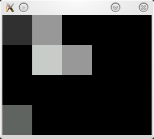
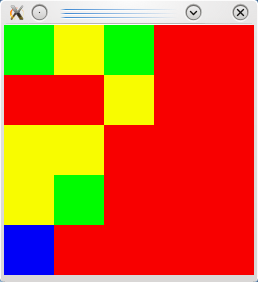
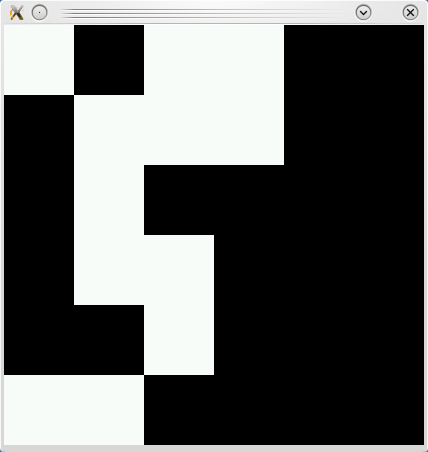

infinerator
============================

What is it?
----------------------------
Image generator to generate every possible combination of a given resolution 
and color depth. It uses Boost and SDL. 
Its practical use is unknown.

Usage
----------------------------
See ./infinerator -h to get a complete list of available program options. 
Just ./infinerator without any options will work fine as well if you just want 
to see the program in action using some sensible defaults. It does not save any
image by default so don't worry.

Compiling
----------------------------

A Code::Blocks project file is included but compiling by hand will work fine.
Try:

    g++ -o infinterator -O2 `sdl-config --cflags --libs` -lboost_program_options-mt -lboost_filesystem-mt -lboost_regex-mt main.cpp

License
----------------------------
All sources and files are released under GPL.

----------------------------

Copyright (c) 2010 @ Sven-Hendrik 'Svenstaro' Haase
